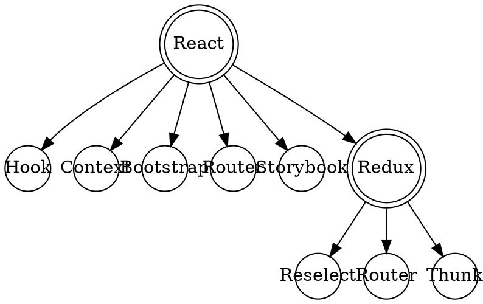

Tech. Tree
---

```graphviz
digraph G {
  React [shape=doublecircle, width=0.75 fixedsize=true]
  React_Hook [shape=circle, width=0.5, fixedsize=true, label="Hook"]
  React_Context [shape=circle, width=0.5, fixedsize=true, label="Context"]
  React_Bootstrap [shape=circle, width=0.5, fixedsize=true, label="Bootstrap"]
  React_Router [shape=circle, width=0.5, fixedsize=true, label="Router"]
  React_Storybook [shape=circle, width=0.5, fixedsize=true, label="Storybook"]
  Redux [shape=doublecircle, width=0.75 fixedsize=true]
  Redux_Reselect [shape=circle, width=0.5, fixedsize=true, label="Reselect"]
  Redux_Router [shape=circle, width=0.5, fixedsize=true, label="Router"]
  Redux_Thunk [shape=circle, width=0.5, fixedsize=true, label="Thunk"]
  React -> Redux
  React -> React_Hook
  React -> React_Context
  React -> React_Bootstrap
  React -> React_Router
  React -> React_Storybook
  Redux -> Redux_Reselect
  Redux -> Redux_Router
  Redux -> Redux_Thunk
}
```

참고
---
* <https://ko.reactjs.org/docs/hooks-overview.html>